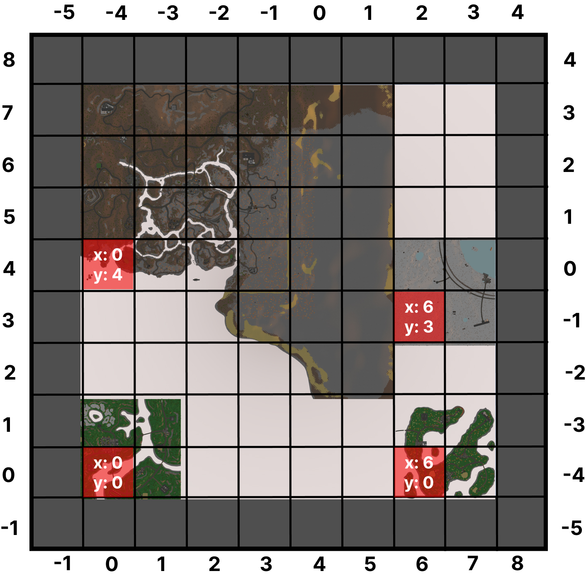

## Unturned Map Merge Tool
Program for merging multiple unturned maps into one.  
Work in progress

### Example maps created using this tool
* [Triple Classic (Peyukton)](https://steamcommunity.com/sharedfiles/filedetails/?id=2867004062) by [adLay](https://steamcommunity.com/profiles/76561199059647240)
* [AMIO (All Maps in One)](https://steamcommunity.com/workshop/filedetails/?id=2877846948) by [landsQuid](https://steamcommunity.com/id/BearFlewOverTheOcean)
* [Trilogy (Triple Classic Remastered)](https://steamcommunity.com/sharedfiles/filedetails/?id=2876376295) by [landsQuid](https://steamcommunity.com/id/BearFlewOverTheOcean)
* [Anomaly](https://steamcommunity.com/workshop/filedetails/?id=2880116065) by [landsQuid](https://steamcommunity.com/id/BearFlewOverTheOcean)

### Currently Mergeable Files
Landscape merge works by renaming and copying the files from the original map.  
All of the `.dat` files I'm reading into objects, shifting the positions inside the files, combining and then saving into the output map directory.

**Landscape**  
* Heightmaps/*
* Holes/*
* Splatmaps/*

**Spawns**
* Fauna.dat
* Items.dat
* Jars.dat
* Players.dat
* Vehicles.dat
* Zombies.dat

**Environment**
* Bounds.dat
* Flags.dat
* Flags_Data.dat
* Nodes.dat
* Paths.dat
* Roads.dat

**Terrain**
* Trees.dat

**Level**
* Buildables.dat
* Objects.dat

### Example board for the insane size map  
This is an example board used to get right coordinates for the map you want to be generated from another  

